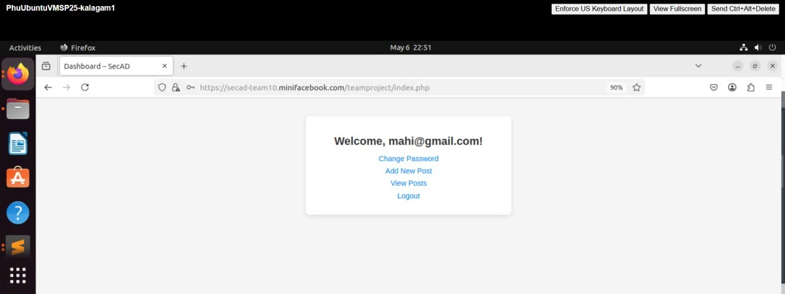
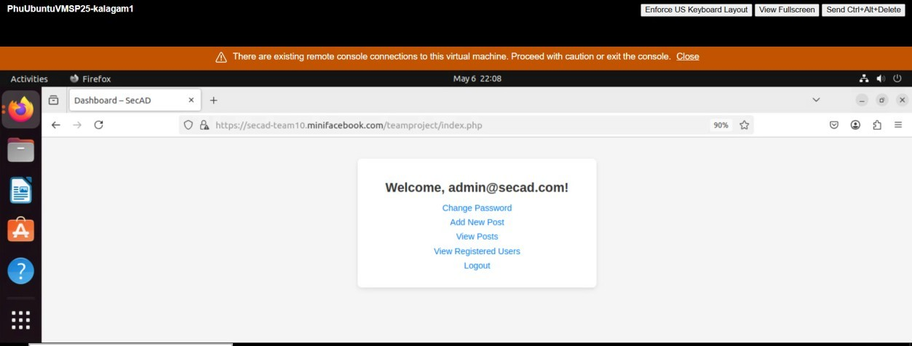
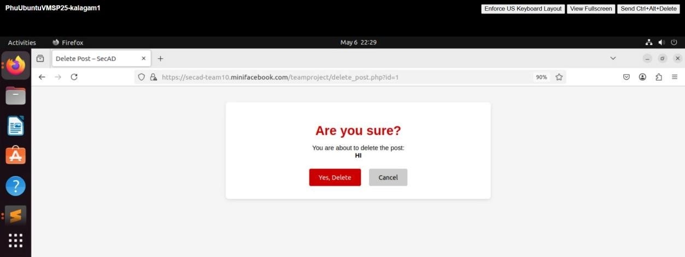
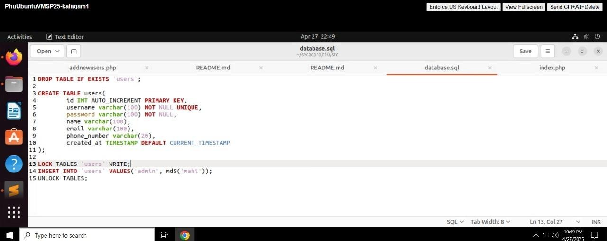

# 🔐 Secure-Blog: Multi-User Platform with Defense-in-Depth

## 📌 Project Overview
This is a full-stack blogging application engineered with a **Security-First** mindset. It demonstrates the implementation of professional-grade security controls to mitigate the OWASP Top 10 vulnerabilities.

## 🛡️ Security Impact and Outcomes
* Focus: Risk Mitigation & Data Integrity
Outcome:
* Neutralized the risk of Unauthorized Data Access and Vertical Privilege Escalation by implementing a strict Role-Based Access Control (RBAC) architecture.
* Prevented Account Takeover (ATO) and session hijacking by engineering a per-session CSRF token validation system for all state-changing actions.
* Improved Database Security by utilizing PDO Prepared Statements, which completely mitigates SQL Injection (SQLi) attacks that lead to data leaks.

## 🛠️ Tech Stack
* **Backend:** PHP, MySQL
* **Frontend:** HTML5, CSS3, JavaScript
* **Tools:** XAMPP, VS Code

## 📸 Security & UI Gallery

| **Role-Based Access (Admin)** | **CSRF Verification** |
|:---:|:---:|
|  |  |

| **Secure Hashed Credentials** |
|:---:|
|  |

## 📂 Folder Structure
* `/src`: Application logic and security middleware.
* `/database`: SQL schema and relational design.
* `/screenshots`: UI previews and security verification.

## 🛠️ Installation & Setup
1. Clone the repository.
2. Import `database/schema.sql` into your MySQL server.
3. Configure `db_connect.php` with your local credentials.
4. Run via XAMPP/Apache on `localhost`.

## 📺 Video Demo
[Link to your YouTube Demo](https://youtu.be/vQwIPN550TQ?feature=shared)

---
*Developed as part of the Secure Application Development (SECAD) curriculum at the University of Dayton.*
